# FILMOTOKIO

[](https://openjdk.org/)
[](https://spring.io/projects/spring-boot)
[](LICENSE)
[](https://www.h2database.com/)

**FILMOTOKIO** is a comprehensive full-stack web application for movie database management, developed as the final project for the Spring Boot Framework Specialization at Tokio School. This platform demonstrates advanced web development practices with a responsive interface for managing films, artists, reviews, and users.

## Overview

The Filmotokio project represents the culmination of advanced Spring Boot studies, showcasing enterprise-level development capabilities through a practical movie management system. The application implements modern architectural patterns, security best practices, and responsive design principles.

## Technology Stack

### Backend Technologies
- **Java 17** - Modern Java with enhanced features and performance improvements
- **Spring Boot 2.7.18** - Enterprise application framework with auto-configuration
- **Spring Data JPA** - Database abstraction layer with repository pattern
- **Spring Security** - Comprehensive authentication and authorization framework
- **Spring Batch** - Enterprise-grade batch processing for data migration
- **H2 Database** - File-based persistence with web console support
- **Maven** - Dependency management and build automation

### Frontend Technologies
- **Thymeleaf** - Modern server-side templating engine
- **HTML5 & CSS3** - Latest web standards with semantic markup
- **Bootstrap 5.3.2** - Responsive UI framework with mobile-first approach
- **Font Awesome 6.5.1** - Comprehensive icon library
- **JavaScript** - Interactive functionality and dynamic behavior

## Core Features

### Movie Management
- Film catalog with poster uploads and comprehensive metadata
- Basic search functionality by title with real-time filtering
- 5-star rating system with visual feedback
- Review system with user comments and moderation
- Film deletion capabilities (admin only)

### User Management
- Secure user authentication and registration system
- User profiles with photo upload capabilities
- Role-based access control (USER/ADMIN roles)
- Administrative panel for comprehensive user management

### Artist Management
- Multi-type artist registration (Actors, Directors, Screenwriters, Musicians, Photographers)
- Film association with multiple artists through many-to-many relationships
- Artist categorization and filtering by professional role

### Technical Features
- **H2 Database** with file-based persistence for development
- Spring Security with BCrypt encryption for password security
- Responsive design using Bootstrap framework
- Spring Batch integration for data migration and export
- Comprehensive file upload handling for posters and profile images

## Project Showcase

### **Home Dashboard**


Main dashboard displaying all films in the database with average ratings and poster images.

---

### **Authentication System**

#### **Login Interface**


Login form with username and password authentication.

#### **User Registration**
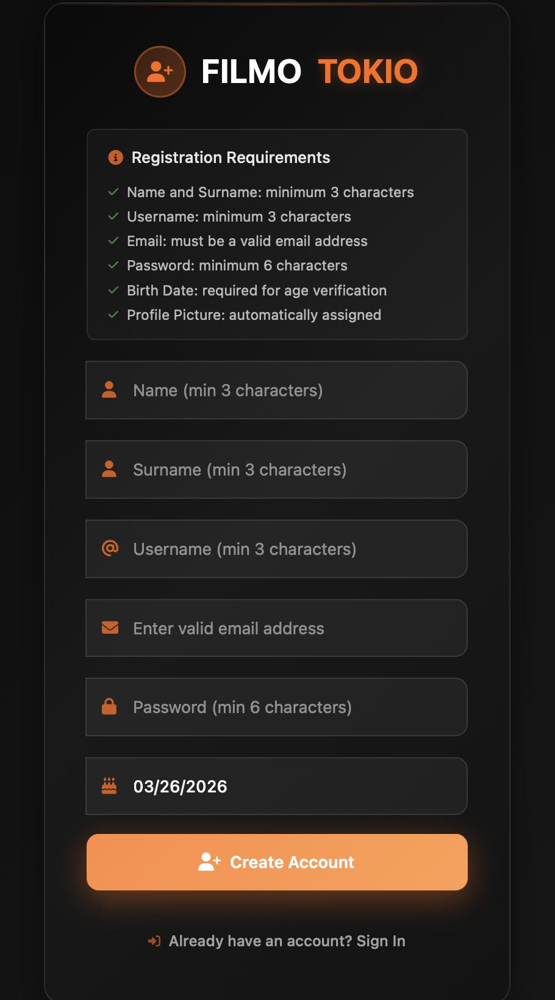

Registration form for new users with basic information fields.

---

### **Navigation & User Experience**

#### **Main Navigation**


Navigation bar with access to main features and user menu.

#### **Navigation Dropdown**
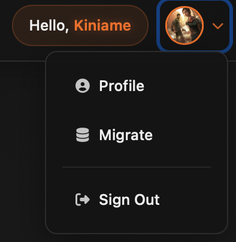

User menu dropdown with profile and logout options.

---

### **Movie Management Features**

#### **Film Details Page**
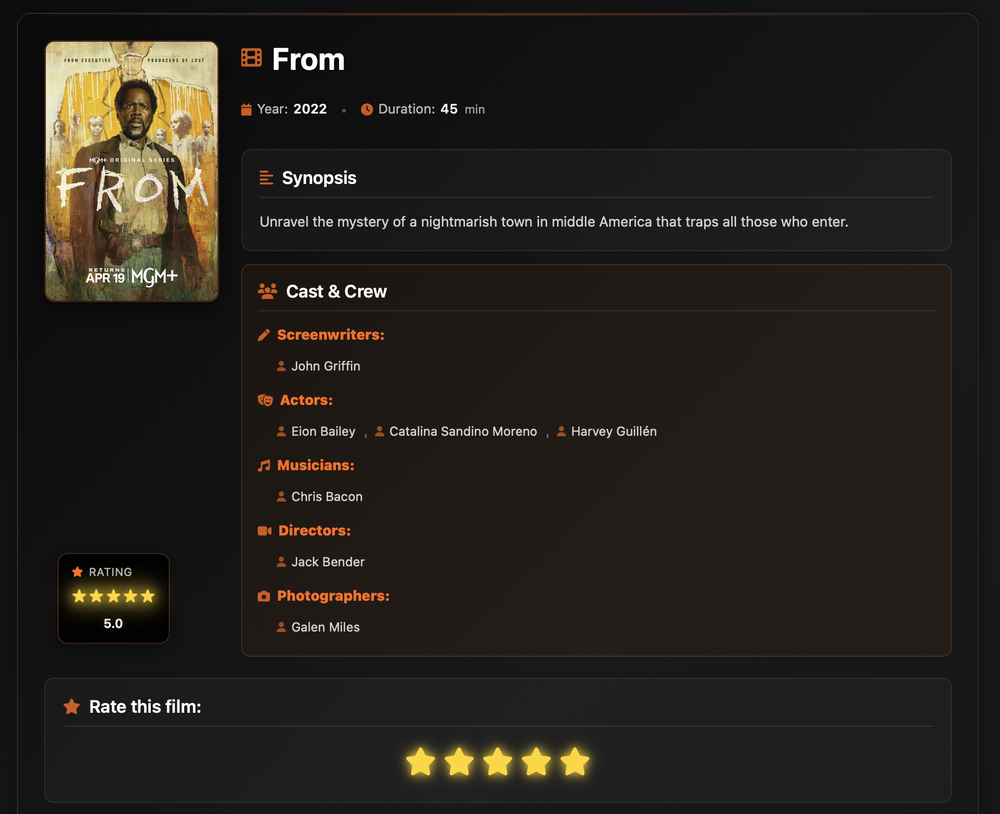

Individual film page showing details, ratings, reviews, and cast information.

#### **Basic Search**
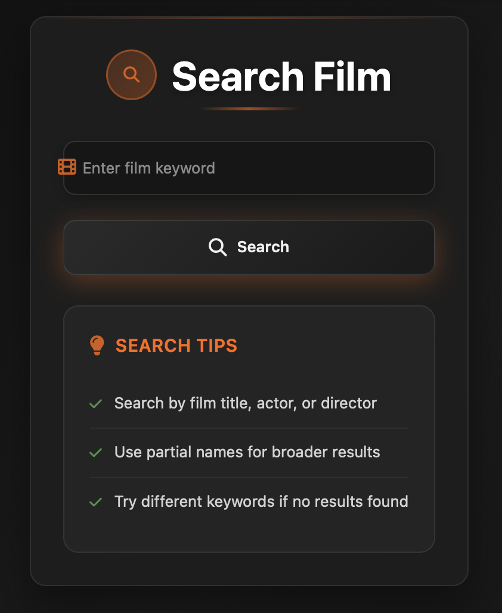

Simple search interface to find films by title.

#### **Search Results**
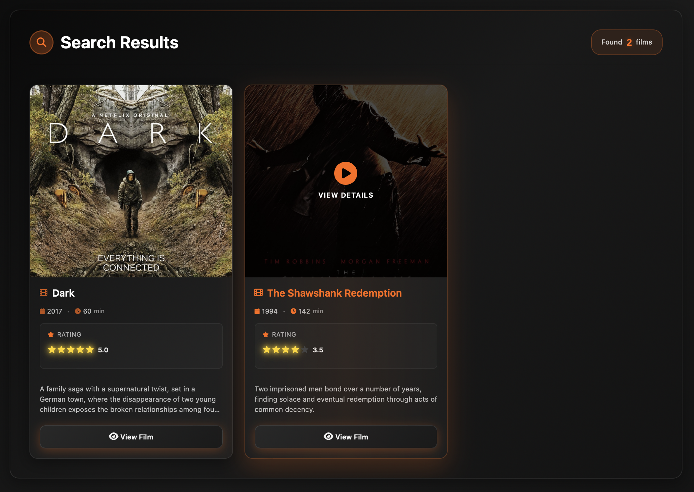

Search results displaying matching films with posters and ratings.

---

### **User Profile System**

#### **Profile Page**
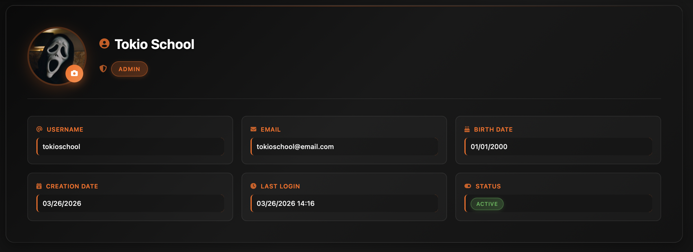

User profile page with personal information and settings.

#### **User Reviews**
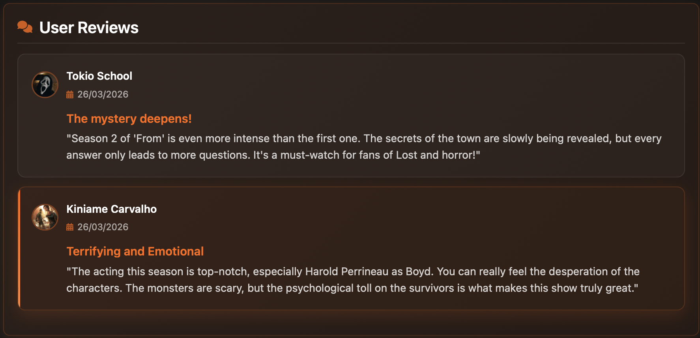

Section displaying user's film reviews and ratings.

---

### **Administrative Features**

#### **Admin User Management**
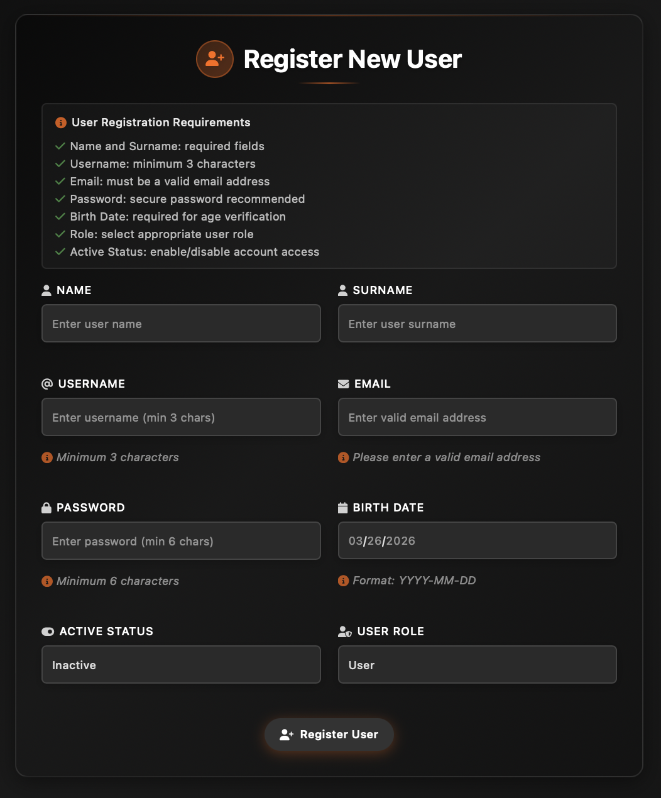

Admin interface for registering new users with role assignment.

#### **Artist Registration**
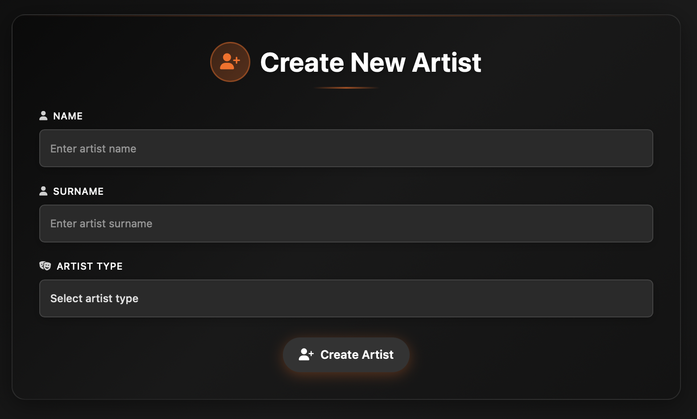

Form for registering new artists with role selection.

#### **Data Migration System**
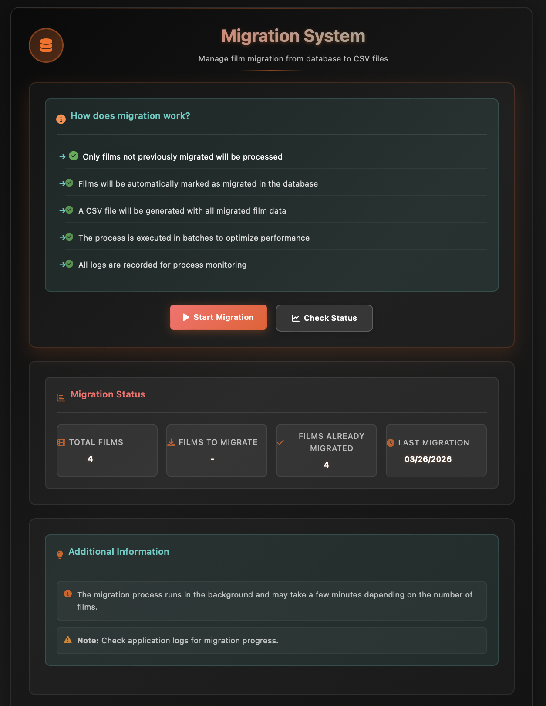

Spring Batch interface for exporting film data to CSV format.

---

### **UI/UX Details**

#### **Footer Design**
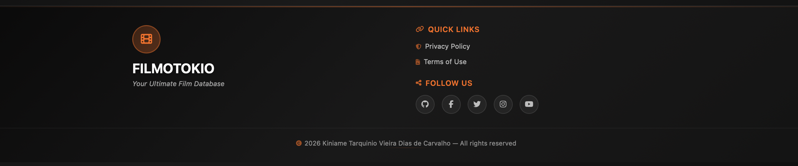

Footer with navigation links and project information.

#### **Delete Confirmation**
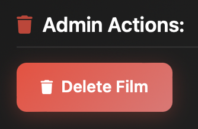

Film deletion interface available to administrators.

## Technologies Used

### **Backend**
- **Java 17** - Modern Java with enhanced features
- **Spring Boot 2.7.18** - Enterprise application framework
- **Spring Data JPA** - Database abstraction layer
- **Spring Security** - Authentication and authorization
- **Spring Batch** - Data processing and migration
- **H2 Database** - File-based persistence (default)
- **MySQL/PostgreSQL** - Production database options
- **Maven** - Dependency management

### **Frontend**
- **Thymeleaf** - Server-side templating engine
- **HTML5 & CSS3** - Modern web standards
- **Bootstrap 5.3.2** - Responsive UI framework
- **Font Awesome 6.5.1** - Icon library
- **Vanilla JavaScript** - Interactive functionality

### **Design System**
- **CSS Variables** - Consistent theming
- **Responsive Grid** - Mobile-compatible layout
- **Component Architecture** - Modular CSS structure
- **Bootstrap Integration** - UI framework components

## Recent Updates (2026)

### Database & Configuration Fixes
- **Java 17 Compatibility:** Fixed Lombok compatibility issues for Java 17
- **H2 Database:** Configured with file-based persistence for data retention
- **Spring Batch:** Fixed sequence creation for H2 database compatibility
- **Database-Agnostic Sequences:** NEW - Automatic detection and support for both H2 and MySQL databases
- **Multi-Database Support:** Seamless switching between H2 (development) and MySQL (production)
- **Poster Display:** Resolved poster image loading issues with correct path mapping
- **Web Configuration:** Updated static resource handling for uploads directory

### Enhanced User Experience
- **Poster System:** Working poster display for all films (home, detail, search pages)
- **Data Initialization:** Automatic sample data creation with proper poster paths
- **Home Page:** Streamlined layout with featured films section
- **Image Management:** Proper upload directory configuration and serving

### Code Quality Improvements
- **Java 17 Support:** Full compatibility with proper environment setup
- **Database Schema:** Fixed Spring Batch sequence creation for H2
- **Database-Agnostic Architecture:** Intelligent database detection and sequence handling
- **Fallback Mechanisms:** Robust error handling with multiple database syntax support
- **Static Resources:** Corrected file serving configuration
- **Error Handling:** Improved startup and runtime error resolution

## Project Structure

```
filmotokio/
├── src/main/java/filmotokio/
│   ├── controller/          # REST controllers
│   ├── domain/              # JPA entities (Film, Person, User, Review)
│   ├── dto/                 # Data Transfer Objects
│   ├── repository/         # Spring Data repositories
│   ├── service/            # Business logic services
│   ├── security/           # Security configurations
│   ├── batch/              # Spring Batch configuration
│   ├── util/               # Utility classes
│   └── config/             # Application configurations
├── src/main/resources/
│   ├── templates/          # Thymeleaf HTML templates
│   │   ├── fragments/      # Reusable template fragments
│   │   ├── admin/          # Admin panel pages
│   │   └── *.html          # Main application pages
│   └── static/
│       ├── css/            # Professional CSS architecture
│       ├── js/             # JavaScript files
│       └── images/         # Static images
├── uploads/                # User uploaded content
├── data/                   # H2 database files
├── pom.xml                 # Maven configuration
├── LICENSE                 # MIT License
└── README.md              # This file
```

## Main Features

### Movie Management
- Full movie registration with poster uploads
- Advanced search by title, director, or actor
- Enhanced star ratings (1-5 stars) with directional glow animations
- Comments and review system with user profiles
- Visual catalog with responsive cards and hover effects
- Film details page with comprehensive information

### Artist Management
- Registration of people (actors, directors, screenwriters, musicians)
- Multiple associations between movies and artists
- Filtering by participation type with visual indicators
- Artist profiles with filmography

### User Management
- Authentication system (login/register) with secure validation
- User profiles with photo upload and personal information
- Role-based access: USER and ADMIN
- Enhanced profile page with activity statistics
- Profile photo management with modal upload interface

### Data Migration
- **NEW:** Fixed SQL compatibility for H2 database
- **NEW:** Spring Batch job for film data export to CSV
- **NEW:** Migration status monitoring
- **NEW:** Custom row mapper for cross-database queries

### Database Features
- **H2:** In-memory database for development and testing (default)
- **MySQL:** Production-ready with full feature support
- **PostgreSQL:** Alternative production option
- **Automatic schema management** with Hibernate DDL
- **Database-agnostic queries** for cross-platform compatibility
- **Migration system** for data export and backup

## Database Configuration

### **Multi-Database Support**
The application features **intelligent database detection** for seamless switching:

#### **H2 Database (Default - Development)**
- **Zero Configuration** - Works out of the box
- **File-based persistence** - Data survives restarts
- **Web Console** - Available at `http://localhost:8080/h2-console`
- **Data Location** - `./data/filmotokio`

#### **MySQL Database (Production)**
```properties
# application.properties
spring.datasource.url=jdbc:mysql://localhost:3306/filmotokio?createDatabaseIfNotExist=true
spring.datasource.username=your_mysql_user
spring.datasource.password=your_mysql_password
spring.jpa.properties.hibernate.dialect=org.hibernate.dialect.MySQL8Dialect
```

#### **PostgreSQL Database (Alternative)**
```properties
# application.properties
spring.datasource.url=jdbc:postgresql://localhost:5432/filmotokio
spring.datasource.username=your_postgres_user
spring.datasource.password=your_postgres_password
spring.jpa.properties.hibernate.dialect=org.hibernate.dialect.PostgreSQLDialect
```

### **Database-Agnostic Spring Batch Sequences**
Automatic detection and creation of Spring Batch sequences for both H2 and MySQL:
- **H2:** Uses `CREATE SEQUENCE` syntax
- **MySQL:** Uses `CREATE TABLE ... AUTO_INCREMENT` syntax
- **Fallback:** Graceful error handling with multiple strategies

## Design and UX/UI

### Visual Features
- Modern, responsive interface with mobile-first approach
- Premium dark theme with advanced visual effects
- Glass morphism design with backdrop filters and gradients
- Interactive navbar with smooth transitions
- Enhanced footer with multiple sections and links
- Forms with visual validation and real-time feedback
- Cards and buttons with smooth animations and hover states

### Enhanced Elements
- Star rating system with left-to-right sweep animations
- Search interface with icon positioning and visual feedback
- Profile containers with optimized width and spacing
- Overlay effects on movie posters with perfect centering
- Responsive grids that adapt to all screen sizes

## Quick Start

### **Prerequisites**
- **Java 17** (Required - project configured for Java 17)
- **Maven 3.6+**
- **IDE** (IntelliJ/Eclipse)

### **Zero-Configuration Setup with H2**

The project comes **pre-configured with H2 Database** - no additional setup needed!

1. **Clone the repository:**
   ```bash
   git clone https://github.com/KTVDCarvalho/filmotokio.git
   cd filmotokio
   ```

2. **Set Java 17 environment:**
   ```bash
   export JAVA_HOME=/Library/Java/JavaVirtualMachines/microsoft-17.jdk/Contents/Home
   java -version  # Should show: java version "17.x.x"
   ```

3. **Run the application:**
   ```bash
   mvn spring-boot:run
   ```

4. **Access the application:**
   - **Main App:** http://localhost:8080
   - **H2 Console:** http://localhost:8080/h2-console

### **Default Credentials**
```
Username: tokioschool
Password: Tokioschool
Role: ADMIN
```

### **Sample Data Included**
The application automatically creates sample films:
- **Interstellar** (2014)
- **Dark** (2017) 
- **From** (2022)
- **The Shawshank Redemption** (1994)

## Project Architecture

```
filmotokio/
├── src/main/java/filmotokio/
│   ├── controller/          # REST controllers and web endpoints
│   ├── model/              # JPA entities (Film, Person, User, Review)
│   ├── repository/         # Spring Data repositories
│   ├── service/            # Business logic services
│   ├── util/               # Utility classes (StarRatingUtil, etc.)
│   └── config/             # Security and configuration
├── src/main/resources/
│   ├── templates/          # Thymeleaf HTML templates
│   │   ├── fragments/      # Reusable template fragments
│   │   ├── admin/          # Admin panel pages
│   │   └── *.html          # Main application pages
│   └── static/
│       ├── css/            # Professional CSS architecture
│       ├── js/             # JavaScript files
│       └── images/         # Static images
├── uploads/                # User uploaded content
├── pom.xml                 # Maven configuration
├── LICENSE                 # MIT License
└── README.md              # This file
```

### Production Setup (MySQL/PostgreSQL)

For production deployment, you can switch to MySQL or PostgreSQL:

1. **MySQL Database Setup:**
   ```properties
   # In application.properties, comment H2 config and uncomment:
   spring.datasource.url=jdbc:mysql://localhost:3306/filmotokio?createDatabaseIfNotExist=true&useSSL=false&allowPublicKeyRetrieval=true
   spring.datasource.username=your_mysql_user
   spring.datasource.password=your_mysql_password
   spring.jpa.properties.hibernate.dialect=org.hibernate.dialect.MySQL8Dialect
   ```

2. **PostgreSQL Database Setup:**
   ```properties
   # In application.properties, comment H2 config and uncomment:
   spring.datasource.url=jdbc:postgresql://localhost:5432/filmotokio
   spring.datasource.username=your_postgres_user
   spring.datasource.password=your_postgres_password
   spring.jpa.properties.hibernate.dialect=org.hibernate.dialect.PostgreSQLDialect
   ```

### Database Features
- **H2:** File-based persistence (data survives restarts)
- **Automatic schema management** with Hibernate DDL
- **Database-agnostic queries** for cross-platform compatibility
- **Migration system** for data export and backup

## Troubleshooting

### **Common Issues & Solutions**

#### **Java Version Issues**
```bash
Error: Fatal error compiling: java.lang.ExceptionInInitializerError
```
**Solution:** The project requires **Java 17**
```bash
export JAVA_HOME=/Library/Java/JavaVirtualMachines/microsoft-17.jdk/Contents/Home
java -version  # Should show 17.x.x
```

#### **Port 8080 Already in Use**
```bash
Error: Port 8080 was already in use
```
**Solution:** Kill the process
```bash
lsof -ti:8080 | xargs kill -9
```

#### **Spring Batch Sequence Errors**
```bash
Error: Sequence "BATCH_JOB_SEQ" not found
```
**Solution:** The application handles this automatically. Restart if issues persist.

#### **Poster Images Not Displaying**
**Solution:** Verify uploads directory
```bash
ls -la uploads/
# Should contain: Interstellar.jpg, Dark.jpg, From.jpg, The Shawshank Redemption.jpg
```

## Security Features

- **Spring Security** with comprehensive authentication
- **BCrypt Encryption** for password security
- **Role-Based Access Control** (USER/ADMIN)
- **CSRF Protection** and input validation
- **Secure File Uploads** with type validation
- **Session Management** with timeout controls

## Data Model

### **Core Entities**
- **Film:** id, title, year, duration, synopsis, poster_url
- **Person:** id, name, surname, type (ACTOR, DIRECTOR, etc.)
- **User:** id, name, surname, username, email, password, role, image
- **Review:** id, rating, comment, user_id, film_id
- **Role:** id, name (USER, ADMIN)

### **Relationships**
- **Film ↔ Person:** Many-to-many (through film_person table)
- **Film ↔ Review:** One-to-many
- **User ↔ Review:** One-to-many
- **User ↔ Role:** Many-to-one

## API Endpoints

### **Public Endpoints**
- `GET /` - Home page with featured films
- `GET /films` - Movie list with pagination
- `GET /films/{id}` - Movie details page
- `POST /films` - Create new movie (ADMIN)
- `GET /search` - Movie search interface
- `POST /login` - User authentication
- `POST /register` - User registration
- `GET /profile` - User profile page

### **Admin Endpoints**
- `GET /admin` - Admin dashboard
- `POST /admin/register` - Register new users
- `GET /admin/migration` - Data migration interface
- `POST /profile/upload-photo` - Profile photo upload

## Project Highlights

### **Interface Features**
- Clean and functional design
- Star rating system for films
- Responsive layout for different devices
- Basic transitions and hover effects

### **Performance**
- Optimized database queries with JPA
- Efficient image handling
- Organized CSS/JS structure
- Basic lazy loading for film lists

### **Code Quality**
- Well-structured code with documentation
- Proper error handling and validation
- Logging for debugging
- Separation of concerns

## Future Roadmap

### **Short Term**
- **REST API** for mobile applications
- **Movie Recommendation System** based on user preferences
- **External API Integration** (TMDB, IMDb)
- **Enhanced Image Upload** with compression and optimization

### **Long Term**
- **Notification System** for new releases and reviews
- **Real-time Chat** for film discussions
- **Dockerization** and container deployment
- **CI/CD Pipeline** with automated testing
- **Mobile Applications** (React Native/Flutter)

## About the Author

### **Kiniame Tarquinio Vieira Dias de Carvalho**

**Full Stack Java Developer** passionate about creating sophisticated web applications with modern technologies.

#### **Connect With Me**
- **GitHub:** [KTVDCarvalho](https://github.com/KTVDCarvalho)
- **Email:** [kiniame.carvalho@icloud.com](mailto:kiniame.carvalho@icloud.com)
- **LinkedIn:** [Connect with me](https://linkedin.com/in/kiniame-carvalho)

#### **Technical Expertise**
- **Backend:** Java, Spring Boot, Spring Security, JPA, Microservices
- **Frontend:** HTML5, CSS3, JavaScript, Bootstrap, Thymeleaf
- **Databases:** H2, MySQL, PostgreSQL, MongoDB
- **Tools:** Maven, Git, Docker, CI/CD

---

## License

This project is licensed under the **MIT License** - see the [LICENSE](LICENSE) file for details.

## Contributing

Contributions are welcome! Please feel free to submit a Pull Request. For major changes, please open an issue first to discuss what you would like to change.

### **Contribution Guidelines**
1. Fork the repository
2. Create a feature branch (`git checkout -b feature/AmazingFeature`)
3. Commit your changes (`git commit -m 'Add some AmazingFeature'`)
4. Push to the branch (`git push origin feature/AmazingFeature`)
5. Open a Pull Request

## Support

If you have any questions or need support:
- **Open an issue** on [GitHub](https://github.com/KTVDCarvalho/filmotokio/issues)
- **Contact the author** directly
- **Check the documentation**

---

# FILMOTOKIO - Your Complete Movie Management Solution

**Built with passion using Java 17 + Spring Boot + Modern Web Technologies**

*showcasing enterprise-grade development skills with a focus on user experience and technical excellence*
